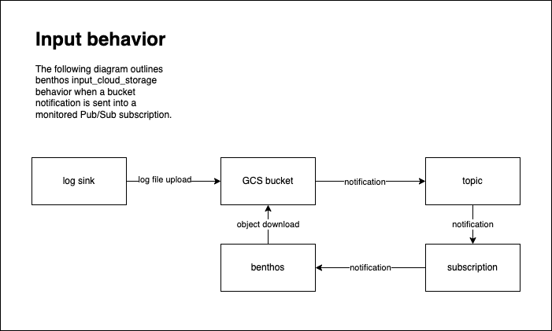

# input_cloud_storage

The following diagram illustrates how `input_cloud_storage` integrates with a [bucket notification](https://cloud.google.com/storage/docs/pubsub-notifications) subscription.

To support this architecture, the Pulumi contained in this folder sets up the following cloud infrastructure components:

* Pub/Sub topic for dead letters
* Pub/Sub subscription for dead letters
* Pub/Sub topic for Cloud Storage notifications
* Pub/Sub subscription for notifications
* IAM permitting project Cloud Storage service account to publish notifications to topic
* IAM permitting project Pub/Sub service account to publish to dead letter topic
* IAM permitting Benthos service account to subscribe to the notification subscription
* IAM permitting project Pub/Sub service account to subscribe to the notification subscription
* Cloud Storage bucket for log files
* IAM permitting Benthos to read/write/delete files in bucket
* Notification to Pub/Sub topic configured on bucket
* Logging router/sink configured to publish project audit logs to bucket
* IAM permitting logging router/sink identity to write to bucket